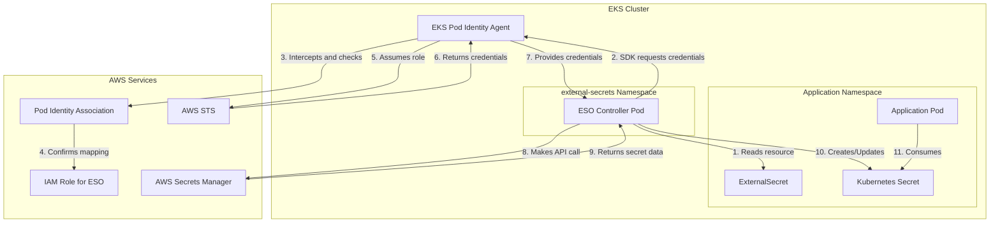

# External Secrets Operator (ESO) with EKS Pod Identity

This guide demonstrates how to set up External Secrets Operator (ESO) with EKS Pod Identity to securely retrieve secrets from AWS Secrets Manager without using static credentials.

## Overview

EKS Pod Identity provides a secure and simplified way for Kubernetes pods to authenticate with AWS services. By mapping a Kubernetes `ServiceAccount` to an AWS IAM Role, it allows pods to assume that role automatically, eliminating the need for static AWS credentials and managing credential rotation seamlessly.

This approach is simpler than its predecessor, IRSA (IAM Roles for Service Accounts), because the credential logic is handled entirely by the **EKS Pod Identity Agent**, removing the need for complex `auth` configurations in your `SecretStore` or `ClusterSecretStore`.

---

## Architecture and Corrected Flow

The central component is the **EKS Pod Identity Agent**, which runs as a `DaemonSet` on each node. It acts as a credential provider, not a network proxy.

### Corrected Architecture Flow



### Flow Steps Explanation

The diagram shows the corrected authentication flow:

1. **Read ExternalSecret**: The ESO Controller detects an ExternalSecret resource in an application namespace.

2. **Request Credentials**: The AWS SDK inside the ESO pod tries to get credentials by calling the local EC2 metadata endpoint.

3. **Intercept & Validate**: The Pod Identity Agent running on the node intercepts this call. It checks for a PodIdentityAssociation that maps the pod's ServiceAccount to an IAM Role.

4. **Assume Role**: Finding a valid association, the agent calls AWS STS to assume the mapped IAM Role.

5. **Receive Credentials**: STS returns temporary, short-lived AWS credentials to the agent.

6. **Provide Credentials**: The agent passes these credentials back to the AWS SDK inside the ESO pod. The agent's job is now done for this request.

7. **Direct API Call**: Now fully authenticated, the ESO pod makes a direct API call to AWS Secrets Manager to fetch the secret value.

8. **Receive Secret Data**: AWS Secrets Manager validates the credentials and returns the secret data directly to the ESO pod.

9. **Create Kubernetes Secret**: The ESO controller creates a native Kubernetes Secret in the target namespace with the data it received.

10. **Consume Secret**: The application pod mounts or consumes the Kubernetes Secret as environment variables.

## Prerequisites

- An EKS cluster with the Pod Identity add-on installed.
- `aws-cli` configured with permissions to manage EKS and IAM.
- `kubectl` configured to access your EKS cluster.
- `helm` for installing External Secrets Operator.

## Step-by-Step Setup

### Step 1: Enable Pod Identity Add-on

If not already enabled, add the `eks-pod-identity-agent` to your cluster.

```bash
aws eks create-addon \
    --cluster-name your-cluster-name \
    --addon-name eks-pod-identity-agent \
    --resolve-conflicts OVERWRITE
```

### Step 2: Create IAM Role and Policy

Create an IAM policy that grants permission to access Secrets Manager.

```bash
# Create the policy document
cat <<EOF > secrets-manager-policy.json
{
    "Version": "2012-10-17",
    "Statement": [
        {
            "Effect": "Allow",
            "Action": [
                "secretsmanager:GetSecretValue",
                "secretsmanager:DescribeSecret"
            ],
            "Resource": "*"
        }
    ]
}
EOF

# Create the policy in IAM
aws iam create-policy \
    --policy-name ExternalSecretsPolicy \
    --policy-document file://secrets-manager-policy.json
```

Next, create the IAM role with a trust policy allowing the EKS Pod Identity service to assume it. Replace `ACCOUNT_ID` with your AWS Account ID.

```bash
# Create the trust policy document
cat <<EOF > trust-policy.json
{
    "Version": "2012-10-17",
    "Statement": [
        {
            "Effect": "Allow",
            "Principal": {
                "Service": "pods.eks.amazonaws.com"
            },
            "Action": "sts:AssumeRole"
        }
    ]
}
EOF

# Create the role and attach the policy
aws iam create-role \
    --role-name ExternalSecretsRole \
    --assume-role-policy-document file://trust-policy.json

aws iam attach-role-policy \
    --role-name ExternalSecretsRole \
    --policy-arn arn:aws:iam::ACCOUNT_ID:policy/ExternalSecretsPolicy
```

### Step 3: Install External Secrets Operator

Install ESO into its own namespace using Helm.

```bash
helm repo add external-secrets https://charts.external-secrets.io
helm repo update

helm install external-secrets external-secrets/external-secrets \
    --namespace external-secrets \
    --create-namespace \
    --set serviceAccount.name=external-secrets
```

### Step 4: Create Pod Identity Association

Map the ESO ServiceAccount to the IAM role you created. Replace `ACCOUNT_ID` again.

```bash
aws eks create-pod-identity-association \
    --cluster-name your-cluster-name \
    --namespace external-secrets \
    --service-account external-secrets \
    --role-arn arn:aws:iam::ACCOUNT_ID:role/ExternalSecretsRole
```

### Step 5: Create a ClusterSecretStore

With Pod Identity, the ClusterSecretStore is incredibly simple. No `auth` section is required. The agent handles everything automatically.

```yaml
# cluster-secret-store.yaml
apiVersion: external-secrets.io/v1beta1
kind: ClusterSecretStore
metadata:
  name: aws-secrets-manager
spec:
  provider:
    aws:
      service: SecretsManager
      region: us-east-1 # Change to your AWS region
  retrySettings:
    maxRetries: 3
    retryInterval: 5s
```

Apply it to your cluster:

```bash
kubectl apply -f cluster-secret-store.yaml
```

### Step 6: Create an ExternalSecret

Now, any namespace can use the ClusterSecretStore to create secrets.

```yaml
# external-secret-app.yaml
apiVersion: external-secrets.io/v1beta1
kind: ExternalSecret
metadata:
  name: app-database-secret
  namespace: my-app # Your application namespace
spec:
  refreshInterval: 1h
  secretStoreRef:
    name: aws-secrets-manager     # References the ClusterSecretStore
    kind: ClusterSecretStore      # Important: specify the kind
  target:
    name: database-credentials    # Name of the K8s Secret to be created
    creationPolicy: Owner
  data:
  - secretKey: username           # Key in the K8s Secret
    remoteRef:
      key: my-app/database-creds  # Name of the secret in AWS Secrets Manager
      property: username          # Key within the AWS secret JSON
  - secretKey: password
    remoteRef:
      key: my-app/database-creds
      property: password
```

Apply it:

```bash
kubectl apply -f external-secret-app.yaml -n my-app
```

## Troubleshooting and Verification

### Check the Pod Identity Agent logs:
```bash
kubectl logs -n kube-system -l app.kubernetes.io/name=eks-pod-identity-agent -f
```

### Check the ESO controller logs:
```bash
kubectl logs -n external-secrets -l app.kubernetes.io/name=external-secrets -f
```

### Describe the ExternalSecret for status conditions:
```bash
kubectl describe externalsecret app-database-secret -n my-app
```

### Verify the Kubernetes Secret was created:
```bash
kubectl get secret database-credentials -n my-app
```

### Common Issue: "Access Denied"

Double-check that your IAM policy (`ExternalSecretsPolicy`) has the correct permissions and that the `PodIdentityAssociation` correctly links the `external-secrets` service account to the `ExternalSecretsRole`.