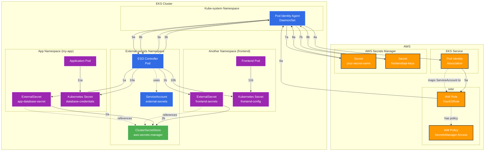

# External Secrets Operator (ESO) with EKS Pod Identity

This guide demonstrates how to set up External Secrets Operator (ESO) with EKS Pod Identity to securely retrieve secrets from AWS Secrets Manager without using static credentials.

## Overview

EKS Pod Identity provides a secure way for Kubernetes pods to authenticate with AWS services by mapping Kubernetes ServiceAccounts to AWS IAM roles. This eliminates the need for static AWS credentials and provides automatic credential rotation.

## Architecture Flow



## Flow Steps Explanation

The diagram shows how Pod Identity automatically handles authentication without requiring ServiceAccount references in ClusterSecretStore:

### Primary Flow (App Namespace):
1. **ESO Controller** reads ExternalSecret in app namespace
2. **ExternalSecret** references ClusterSecretStore (no auth config needed)
3. **ESO** makes AWS API call (automatically intercepted by Pod Identity Agent)
4. **Pod Identity Agent** checks Pod Identity Association for ESO's ServiceAccount
5. **Pod Identity Association** assumes the mapped IAM Role
6. **IAM Role** returns temporary credentials to Pod Identity Agent
7. **Pod Identity Agent** forwards authenticated call to AWS Secrets Manager
8. **AWS Secrets Manager** returns secret data to Pod Identity Agent
9. **Pod Identity Agent** forwards secret data back to ESO Controller
10. **ESO Controller** creates Kubernetes Secret in target namespace
11. **Application Pod** consumes the Kubernetes Secret

### Secondary Flow (Frontend Namespace):
The same flow (steps 1b-11b) occurs simultaneously for other namespaces, all using the same simplified ClusterSecretStore.

### Key Architecture Points:
- **No Auth Configuration**: ClusterSecretStore requires no ServiceAccount reference
- **Automatic Authentication**: Pod Identity Agent handles all AWS authentication
- **ServiceAccount Mapping**: Pod Identity Association maps ESO's ServiceAccount to IAM role
- **Centralized & Simple**: One clean ClusterSecretStore serves multiple namespaces

## Prerequisites

- EKS cluster with Pod Identity add-on installed
- AWS CLI configured with appropriate permissions
- kubectl configured to access your EKS cluster
- External Secrets Operator installed

## Step-by-Step Setup

### Step 1: Enable Pod Identity Add-on (if not already enabled)

```bash
aws eks create-addon \
    --cluster-name your-cluster-name \
    --addon-name eks-pod-identity-agent \
    --resolve-conflicts OVERWRITE
```

### Step 2: Create IAM Role and Policy

Create an IAM policy for Secrets Manager access:

```bash
cat <<EOF > secrets-manager-policy.json
{
    "Version": "2012-10-17",
    "Statement": [
        {
            "Effect": "Allow",
            "Action": [
                "secretsmanager:GetSecretValue",
                "secretsmanager:DescribeSecret"
            ],
            "Resource": "*"
        }
    ]
}
EOF

aws iam create-policy \
    --policy-name ExternalSecretsPolicy \
    --policy-document file://secrets-manager-policy.json
```

Create an IAM role:

```bash
cat <<EOF > trust-policy.json
{
    "Version": "2012-10-17",
    "Statement": [
        {
            "Effect": "Allow",
            "Principal": {
                "Service": "pods.eks.amazonaws.com"
            },
            "Action": [
                "sts:AssumeRole",
                "sts:TagSession"
            ]
        }
    ]
}
EOF

aws iam create-role \
    --role-name ExternalSecretsRole \
    --assume-role-policy-document file://trust-policy.json

aws iam attach-role-policy \
    --role-name ExternalSecretsRole \
    --policy-arn arn:aws:iam::ACCOUNT_ID:policy/ExternalSecretsPolicy
```

### Step 3: Install External Secrets Operator

```bash
helm repo add external-secrets https://charts.external-secrets.io
helm repo update

helm install external-secrets external-secrets/external-secrets \
    --namespace external-secrets \
    --create-namespace \
    --set serviceAccount.name=external-secrets
```

### Step 4: Create Pod Identity Association

```bash
aws eks create-pod-identity-association \
    --cluster-name your-cluster-name \
    --namespace external-secrets \
    --service-account external-secrets \
    --role-arn arn:aws:iam::ACCOUNT_ID:role/ExternalSecretsRole
```

### Step 5: Verify Pod Identity Association

```bash
aws eks list-pod-identity-associations --cluster-name your-cluster-name

# Get detailed information
aws eks describe-pod-identity-association \
    --cluster-name your-cluster-name \
    --association-id YOUR_ASSOCIATION_ID
```

### Step 6: Create ClusterSecretStore

With Pod Identity, the ClusterSecretStore configuration is much simpler - **no ServiceAccount reference needed**:

```yaml
apiVersion: external-secrets.io/v1beta1
kind: ClusterSecretStore
metadata:
  name: aws-secrets-manager
spec:
  provider:
    aws:
      service: SecretsManager
      region: us-west-2  # Change to your AWS region
  retrySettings:
    maxRetries: 5
    retryInterval: 10s
```

Apply the configuration:

```bash
kubectl apply -f cluster-secret-store.yaml
```

**Important Note**: Unlike IRSA, Pod Identity does **not** require an `auth.serviceAccount` section in the ClusterSecretStore. The Pod Identity Agent automatically handles authentication for any pod with a valid Pod Identity Association.

### Step 7: Create ExternalSecret

```yaml
apiVersion: external-secrets.io/v1beta1
kind: ExternalSecret
metadata:
  name: app-secret
  namespace: your-app-namespace
spec:
  refreshInterval: 30s
  secretStoreRef:
    name: aws-secrets-manager
    kind: ClusterSecretStore
  target:
    name: app-credentials
    creationPolicy: Owner
  data:
  - secretKey: password
    remoteRef:
      key: your-secret-name
      property: password
  - secretKey: username
    remoteRef:
      key: your-secret-name  
      property: username
```

Apply the configuration:

```bash
kubectl apply -f external-secret.yaml
```

### Step 8: Use ClusterSecretStore from Application Namespaces

The beauty of ClusterSecretStore is that it can be used from **any namespace** in your cluster. Here's how to consume secrets in your application namespaces:

#### Create Your Application Namespace

```bash
kubectl create namespace my-app
```

#### Create ExternalSecret in Your App Namespace

```yaml
# external-secret-app.yaml
apiVersion: external-secrets.io/v1beta1
kind: ExternalSecret
metadata:
  name: app-database-secret
  namespace: my-app  # Your application namespace
spec:
  refreshInterval: 30s
  secretStoreRef:
    name: aws-secrets-manager     # References the ClusterSecretStore
    kind: ClusterSecretStore      # Important: specify ClusterSecretStore
  target:
    name: database-credentials    # Kubernetes secret created in my-app namespace
    creationPolicy: Owner
  data:
  - secretKey: db_username
    remoteRef:
      key: your-secret-name
      property: username
  - secretKey: db_password
    remoteRef:
      key: your-secret-name
      property: password
```

Apply the ExternalSecret:

```bash
kubectl apply -f external-secret-app.yaml
```

#### Use the Secret in Your Application

You can consume the generated Kubernetes secret in your application deployment:

```yaml
# app-deployment.yaml
apiVersion: apps/v1
kind: Deployment
metadata:
  name: my-app
  namespace: my-app
spec:
  replicas: 1
  selector:
    matchLabels:
      app: my-app
  template:
    metadata:
      labels:
        app: my-app
    spec:
      containers:
      - name: my-app
        image: your-app-image:latest
        # Option 1: Use as environment variables
        env:
        - name: DB_USERNAME
          valueFrom:
            secretKeyRef:
              name: database-credentials  # Secret created by ExternalSecret
              key: db_username
        - name: DB_PASSWORD
          valueFrom:
            secretKeyRef:
              name: database-credentials
              key: db_password
        # Option 2: Mount as volume
        volumeMounts:
        - name: db-secrets
          mountPath: "/etc/secrets"
          readOnly: true
      volumes:
      - name: db-secrets
        secret:
          secretName: database-credentials
```

#### Multiple Namespaces Example

The same ClusterSecretStore can be used across multiple namespaces:

```bash
# Frontend namespace
kubectl create namespace frontend
cat <<EOF | kubectl apply -f -
apiVersion: external-secrets.io/v1beta1
kind: ExternalSecret
metadata:
  name: frontend-secrets
  namespace: frontend
spec:
  refreshInterval: 60s
  secretStoreRef:
    name: aws-secrets-manager
    kind: ClusterSecretStore
  target:
    name: frontend-config
  data:
  - secretKey: api_key
    remoteRef:
      key: frontend/api-keys
      property: third_party_api_key
EOF

# Backend namespace
kubectl create namespace backend
cat <<EOF | kubectl apply -f -
apiVersion: external-secrets.io/v1beta1
kind: ExternalSecret
metadata:
  name: backend-secrets
  namespace: backend
spec:
  refreshInterval: 30s
  secretStoreRef:
    name: aws-secrets-manager
    kind: ClusterSecretStore
  target:
    name: backend-config
  data:
  - secretKey: db_password
    remoteRef:
      key: backend/database
      property: password
EOF
```

### Verify Pod Identity Agent

```bash
kubectl get pods -n kube-system -l app=eks-pod-identity-agent
```

### Check ClusterSecretStore Status

```bash
kubectl get clustersecretstore
kubectl describe clustersecretstore aws-secrets-manager
```

### Check ExternalSecret Status

```bash
kubectl get externalsecret app-secret -n your-app-namespace
kubectl describe externalsecret app-secret -n your-app-namespace
```

### Check Generated Kubernetes Secret

```bash
kubectl get secret app-credentials -n your-app-namespace
kubectl describe secret app-credentials -n your-app-namespace
```

### Check ESO Controller Logs

```bash
kubectl logs -n external-secrets deployment/external-secrets -f
```

### Check Pod Identity Agent Logs

```bash
kubectl logs -n kube-system -l app=eks-pod-identity-agent
```

## Common Issues and Solutions

### Issue: ClusterSecretStore shows "SecretStore validation failed"

**Solution**: With Pod Identity, ensure your ClusterSecretStore has NO ServiceAccount reference (this is different from IRSA):

```yaml
# Correct for Pod Identity
spec:
  provider:
    aws:
      service: SecretsManager
      region: your-region
  # No auth section needed!
```

If you have an `auth.serviceAccount` section, remove it when using Pod Identity.

### Issue: "Access denied" errors

**Solution**: Verify IAM role permissions and Pod Identity Association:

```bash
# Check IAM role policies
aws iam list-attached-role-policies --role-name ExternalSecretsRole

# Check Pod Identity Association
aws eks describe-pod-identity-association \
    --cluster-name your-cluster-name \
    --association-id YOUR_ASSOCIATION_ID
```

### Issue: ESO pods not using the correct ServiceAccount

**Solution**: Verify ESO deployment ServiceAccount:

```bash
kubectl get deployment external-secrets -n external-secrets -o yaml | grep serviceAccount
```

## Benefits of Using ClusterSecretStore

### Centralized Management
- **Single Configuration**: One ClusterSecretStore serves the entire cluster
- **Consistent Authentication**: All namespaces use the same Pod Identity setup
- **Easy Updates**: Modify ClusterSecretStore once, affects all consuming namespaces
- **Simplified RBAC**: No need for namespace-specific ServiceAccount configurations

### Cross-Namespace Usage
- **Reusability**: Same store used across multiple namespaces and applications
- **Namespace Isolation**: Secrets are created in the target namespace, maintaining isolation
- **Flexible Consumption**: Different namespaces can consume different secrets from the same store
- **No Duplication**: Avoid repeating AWS configuration across namespaces

### Authentication Flow
- **Centralized ESO Controller**: Runs in `external-secrets` namespace with Pod Identity
- **Cross-Namespace Operation**: ESO can create secrets in any namespace
- **Secure Access**: Application namespaces don't need AWS credentials or Pod Identity setup
- **Audit Trail**: All AWS access happens through the central ESO controller

## Benefits of Pod Identity over IRSA

## Benefits of Pod Identity over IRSA

- **Simplified Configuration**: No ServiceAccount references needed in SecretStores
- **Automatic Authentication**: Pod Identity Agent handles all credential management
- **Better Performance**: Credentials cached by Pod Identity Agent
- **Enhanced Security**: Credentials never stored in pods
- **Improved Observability**: Better logging and audit trails
- **Centralized Management**: Pod Identity Associations managed through AWS APIs
- **Cleaner YAML**: Eliminates complex auth configurations in SecretStore resources

## Security Best Practices

1. **Least Privilege**: Grant only necessary permissions to the IAM role
2. **Resource Restrictions**: Limit Secrets Manager access to specific secrets using resource ARNs
3. **Regular Rotation**: Implement secret rotation policies in AWS Secrets Manager
4. **Monitoring**: Set up CloudTrail logging for secret access auditing
5. **Network Security**: Use VPC endpoints for Secrets Manager if needed

## Next Steps

- Set up secret rotation policies in AWS Secrets Manager
- Implement monitoring and alerting for secret access
- Consider using AWS Config for compliance monitoring
- Set up backup and disaster recovery for critical secrets